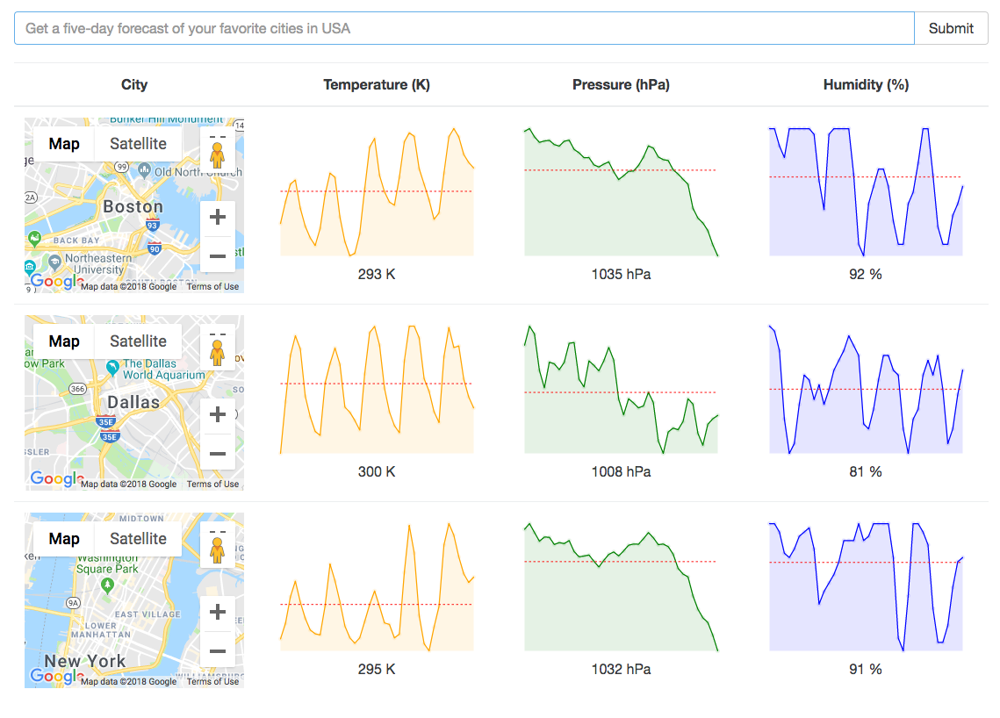

# A basic weather app to learn Redux

This app fetches weather data and displays them in line charts using React and Redux.

## Deploy locally

In order to check this app out, you may clone this repo and then run the command `npm start`. This will enable the app on localhost:8080.

## Screenshot

